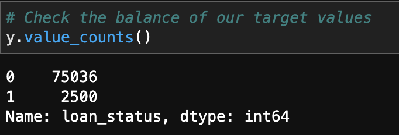
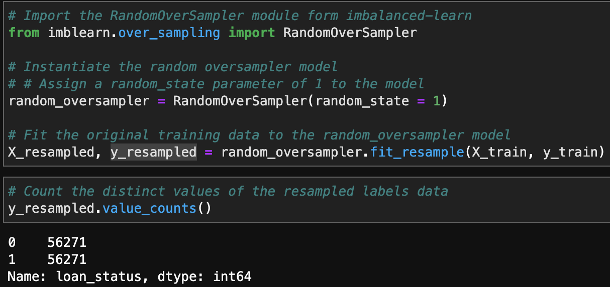

# Loan Risk Analysis Report

## Overview of the Analysis

This analysis follows model-fit-predict-evaluate pattern that is used to leverage Machine Learning - Logistic Regression Model to train and test datasets under original and oversampled circumstances. Based on the evaluation results generated by multiple ratios and reports, different sampling methods were used to achieve optimal prediction accuracy.

* The purpose of the analysis is to built, fit, test, evaluate, and utilize a machine learning model to identify the creditworthness of borrowers based on a dataset of historical lending activity.

* The historical lending activity was built into a CSV file and was translated to information of customers' loan size, interest rate, income, debt to income ratio, number of accounts, derogatory marks, total debt amount, and the status of the loan (good as '0' vs bad as '1'). The machine learning model was traind with 75% of the historical data, and was tested with the other 25% on the accuracy to predict whether the loan was categorized as good or bad.

* Calculation below shows there are 75036 counts good loans and 2500 counts bad loans from the historical dataset.


* Model-fit-predict-evaluate process:

```
from sklearn.model_selection import train_test_split
X_train, X_test, y_train, y_test = train_test_split(X,y,random_state = 1)
```

Code above were used to split the dataset into train and test parts. Logistic regression model was used to fit with training portion of the dataset and predict on the testing portion, as codes shown below.

```
from sklearn.linear_model import LogisticRegression
logistic_regression_model = LogisticRegression(random_state = 1)
testing_predictions = lr_model.predict(X_test)
```
Balanced accuracy score, confusion matrix, and classification report were generated to evaluate the performance of the model.

* Due to the imbalanced dataset, evaluation previously suggests using random over sampler method, where lower weighted portion will increase its amount to match the higher weighted portion on a random basis.


As the picture above shows, the resampled dataset has the same amount of good and bad loans. Then, same procedure were conducted to model, train, fit, predict, and evaluate the resampled data.


## Results
Two sampling methods generated different evaluation results as follow:

* Machine Learning Model with original dataset
  * Balanced Accuracy Score: 0.95
  * Precision Score: good loans 1 vs. bad loans 0.85
  * Recall Scores: good loans 0.99 vs. bad loans 0.91


* Machine Learning Model with resampled dataset:
  * Balanced Accuracy Score: 0.99
  * Precision Score: good loans 1 vs. bad loans 0.84
  * Recall Scores: good loans 0.99 vs. bad loans 0.99


## Summary

According to the balanced accuracy score of .99, the model with oversampled data did great predicting accurately on separating good and bad loans, it has imporved a lot from the original sampled data. Based on Precision calculation, good loans are predicted better than bad loans with 1 vs .84, it hasn't changed much from the originally sampled data. Based on Recall calculation, good loans and bad loans are predict with the same accuracy of .99 and Bad loans has improved its accuracy from .91. Overall, the model predicts better with oversampled data and good loans are predicted more accurately, while bad loans recall rate has improved.

It is more important to identify the bad loans (the '1'), because the cost of not able to identify one bad loan is way greater than wrongly categorize a good loan as bad. Thus, we prefer the sampling method that offers higher recall score, which represent: out of all the actual bad loans, what's the percentage that the model predicted right. Higher recall score will definitely benefit identifying bad loans. Thus oversampling model is recommended based on the analysis.

### License
---

MIT

**Open to Experiment**

### Contributors
---
**Andrie Yanjun Lin**

[E-mail](yanjun.lin.andrie@gmail.com)    
[LinkedIn](https://www.linkedin.com/in/yanjun-linked)
